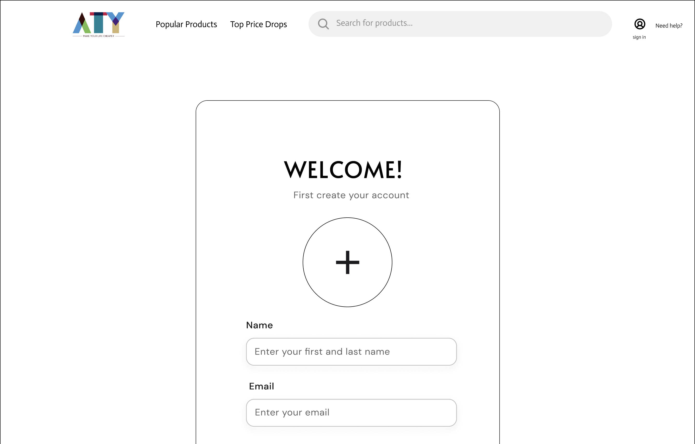
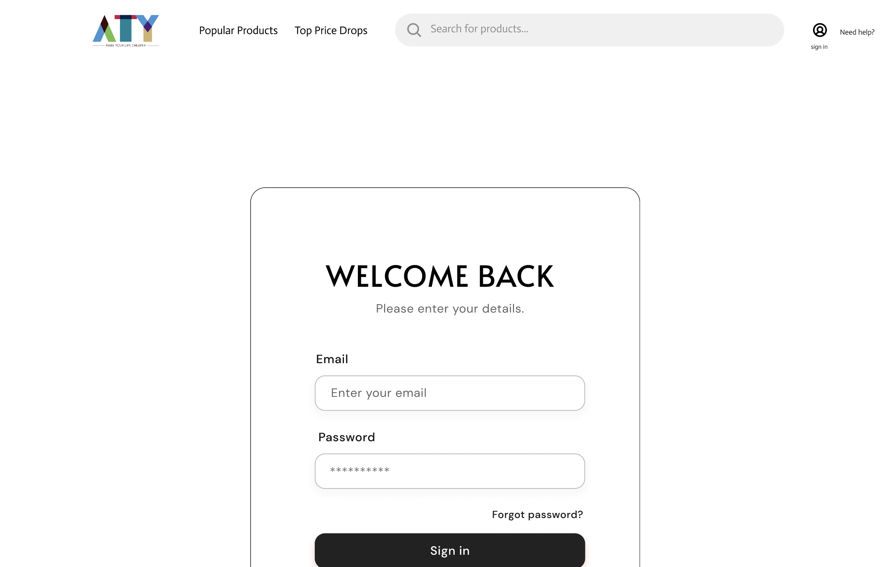
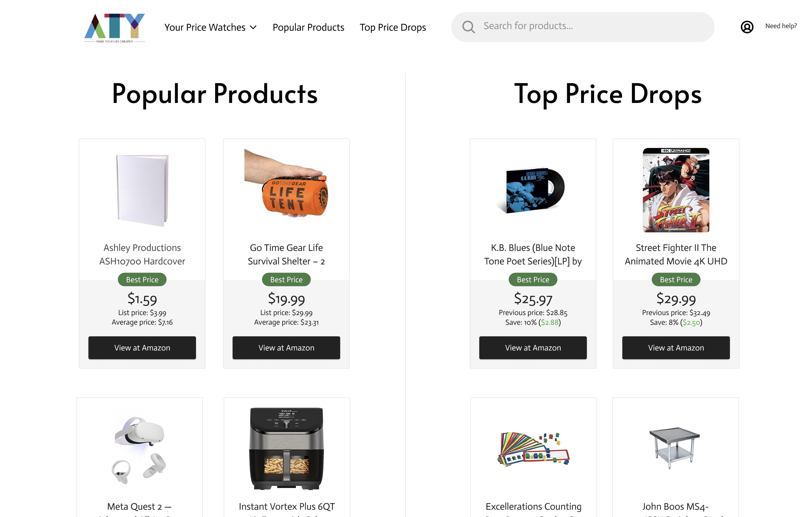
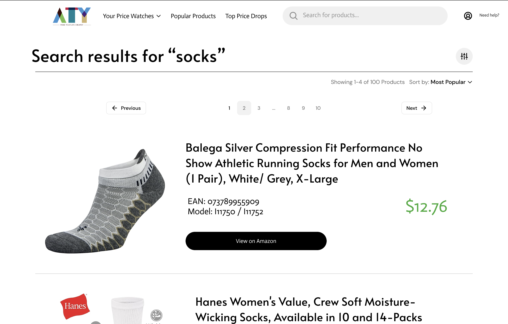
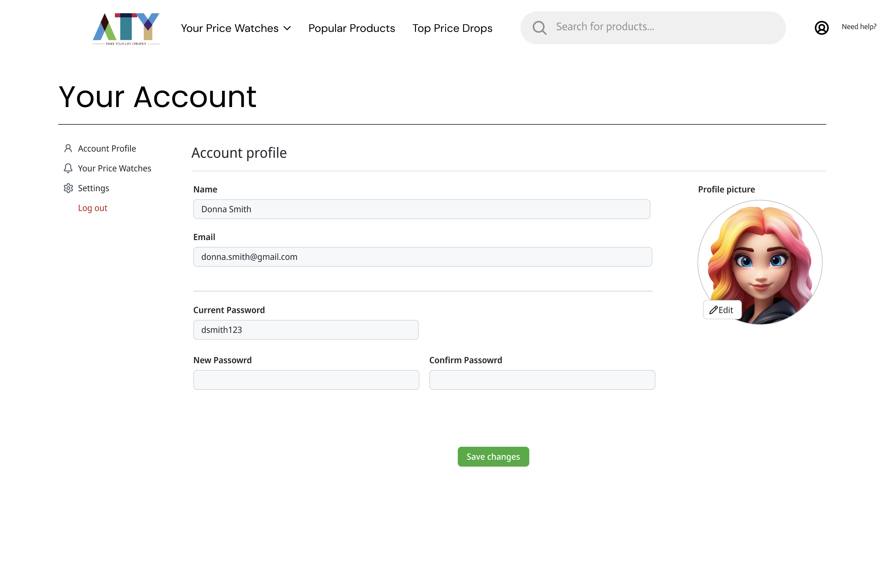
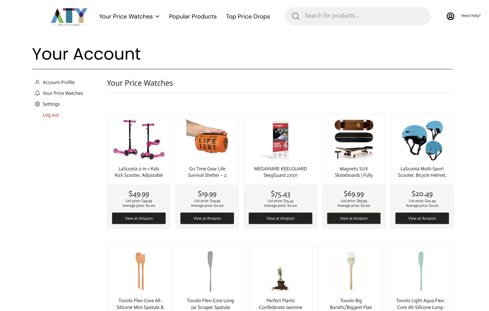
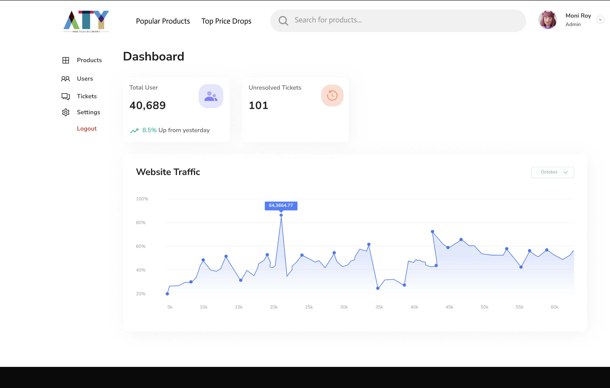
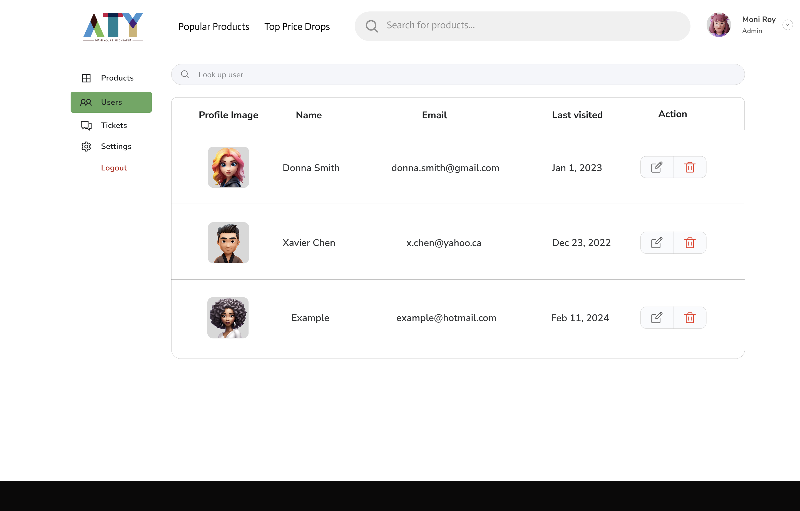
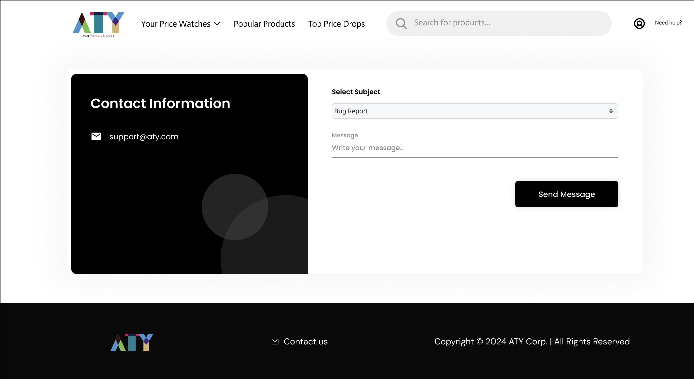
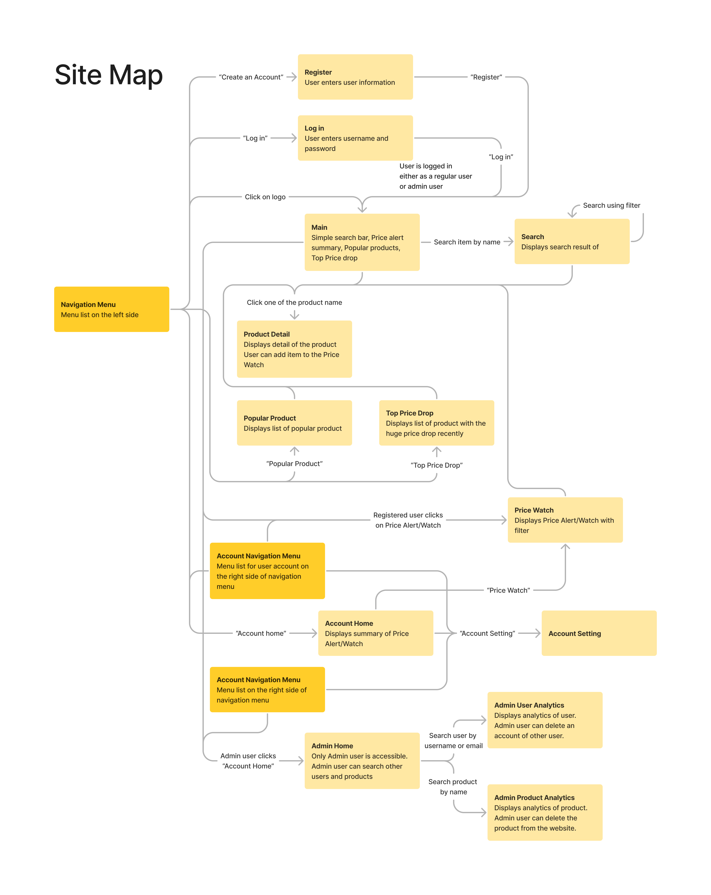

# COSC 360 Project Camelcamelcamel Clone
This is a project from COSC360.  
This project is a website of price tracking on Amazon.  
This project needs to be cloned in XAMPP/htdocs/  

## Procedure of set up
1. On XAMPP, run Apache Web server and MySQL server. 
2. Go to http://localhost/phpmyadmin and run init.sql/ddl.sql until insertion to category table. 
3. Open to http://localhost/COSC360LocalProject/code/php/ddl_images.php to run DDL of images. 
4. Run the rest of ddl.sql on phpMyAdmin. 
5. Go to http://localhost/COSC360LocalProject/code/php/main.php and start browsing. 

## Milestones 1: Proposal

### Team members

Adams Chen 50905454  
Taii Hirano 44551257  
Yuki Isomura 11888757  

### Project Description and Details: Camelcamelcamel Clone

We are developing a website, Camelcamelcamel Clone, designed to offer users a comprehensive platform for tracking and monitoring product prices on Amazon.ca. The website will cater to both registered and unregistered users, providing valuable insights into the pricing trends of various items available on the Amazon platform.

### List of Requirements

#### Unregistered User

- Create an account with their name, email and image
- Edit their account settings/profile
- Search for items by keyword, categories or manufacturer
- Order search results by price (ascending/descending), relevance and average customer rating on Amazon
- Filter search results by attributes
- Display product price, but not product details
- View general price trends of products in real-time
- Aggregate popular products
- Aggregate products with top-price drops

#### Registered User

- Log in to the platform with registered credentials
- View/edit their profile
- Display product details (with comments added)
- Price drop or product availability alert via email
- Add review to the product

#### Administrator

- Search for a user by name or email
- Enable/disable the user account

## Milestones 2: Client-side experience

### Layout

### Organization of Pages

### Logic Process

#### For Users

- Registration/Login:  
Users can register for a new account by providing necessary information like name, email, and password. Alternatively, they can log in if they already have an account.

- Search for Products:  
Users can search for products by name, category, or manufacturer.

- View Product Details:  
Upon finding a product, users can view its details including current price, price history with graphical representations, seller information, product review, and so on.

- Create Price Watch List:  
Users have the option to set price alerts for specific products and add them to a price watch list. They define a target price and monitor price changes over time. When the product’s price drops below that threshold, they receive notifications.
- Explore Deals and Trends:  
Users can explore deals, top price drops, and trending products on the site’s main page.

- Receive Notifications:  
Users receive notifications via email or on-site alerts when there are significant price changes or when price alerts are triggered.

- Manage Price Watch List:  
Users can manage their price watch list by adding new products, removing existing ones, or modifying price alert settings.

- Account Settings:  
Users can manage their account settings, update personal information, and change passwords.

- Provide Feedback:  
Users have the option to provide feedback, report issues, or suggest improvements through a feedback form or contact page.

- Logout:  
Users can securely log out of their accounts to protect their privacy.

#### For Administrators

Note: The administrator possesses the same functionality and access as users, with additional capabilities to engage with the site.

- Admin Dashboard:  
Administrators have access to a dashboard where they can monitor site traffic and user statistics, and perform administrative tasks.

- User Management:  
Administrators can manage user accounts, including searching for a user by name or email and deactivating accounts if necessary.

- Content Management:  
Administrators oversee content management ensuring that appropriate comment is written and managing product reviews by removing them if necessary.

- Product Analytics:  
Administrators can access product analytics and reporting tools to track user engagement, and product popularity and delete products if necessary.

- Customer Support:  
Administrators handle customer support requests, providing assistance to users and resolving any issues or complaints.

### Design and Style Description

On our website, we’ve structured the layout with a header footer, and navigation bar for consistency across all pages. To optimize user experience, we’ve decided to place the navigation links at the top, ensuring easy access for seamless navigation between pages.

On the main page, users will encounter tailored components based on their registration status. For Non-Registered Users, a curated list of popular products will be showcased, featuring product images and highlighting top price drop products. This section aims to engage non-registered users with compelling offers and discounts, encouraging them to explore further and potentially sign up.

For Registered Users, in addition to a list of popular products, a prominent feature is the “Price Alert” button placed at the top of the page. This button serves as a direct link to a list of products within the user’s watch list where prices have dropped. This feature is designed to empower registered users by keeping them updated on price changes for products they are interested in.

Additionally, when users conduct a product search, the results will display a list of products accompanied by clear and visible product images on the left. This presentation enhances the visibility and attractiveness of the listed products, aiding users in making informed decisions.

By implementing these features, we aim to provide a user-friendly experience for both registered and non-registered users, catering to their specific needs and preferences.
